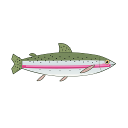
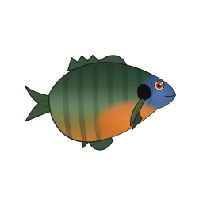
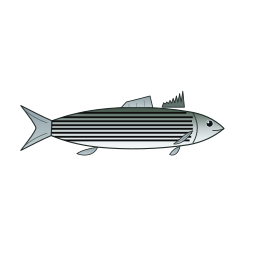
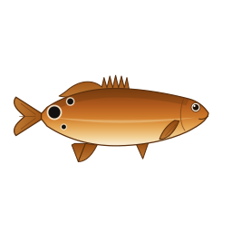
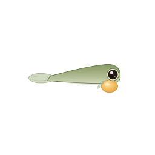
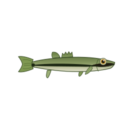
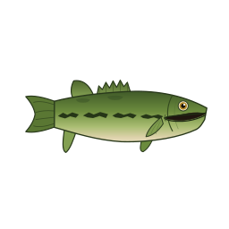
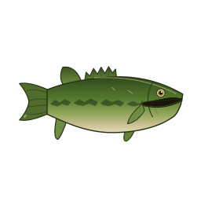
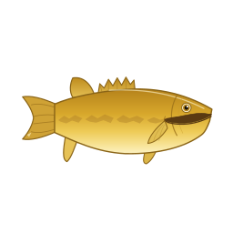

<div align="center">

# 🎣 FishTokenBar

**Your AI token usage, reimagined as a living aquarium of real fish.**

A macOS menu-bar companion that watches how many tokens you burn across your AI CLIs
and turns that effort into a collection you raise, grow, and show off — now with a whole
**Fish** kingdom of real species that anglers actually catch, and that **swim across your screen**.



*Largemouth Bass · Rainbow Trout · Bluegill · Striped Bass · Red Drum — all real, all hand-drawn.*

</div>

---

## What is this?

FishTokenBar sits in your macOS menu bar and reads your **local** AI-CLI usage logs (Claude Code,
Codex, Gemini, and more — nothing leaves your machine). The more tokens you spend getting real
work done, the more your companion grows. It's a gentle, ambient productivity tracker: a glance at
the menu bar tells you how hard you've been working today, and a little creature comes along for the ride.

It started as a fork of the excellent [**PokeTokenBar**](https://github.com/chattymin/PokeTokenBar)
(Pokémon companions). FishTokenBar keeps that mode intact and adds a second **creature kingdom** —
real fish — plus a one-click **Mode** switch between them. The architecture is built so *any* animal
kingdom can be dropped in next.

## 🐟 Fish mode

### Real fish, raised honestly

Real fish don't metamorphose into other species — a bass never "becomes" a trout. So instead of
faking Pokémon-style evolution, FishTokenBar models the **real life stages of one species**. Your
tokens grow a single fish through its honest angling life cycle:

<div align="center">


**Fry → Fingerling → Adult (Keeper) → Lunker (Trophy)** — the same largemouth bass, growing up.
</div>

The app never says a fish "evolves into" another species — it **grows into** its next life stage.
The sprite genuinely changes shape and color as real fish do (drab slim juveniles deepen and
darken into trophy fish).

### The starter Fish Dex

Five iconic sport-and-food species — three freshwater, two saltwater — each verified against real
biology (common **and** scientific names, sizes, and markings):

| # | Species | Water | Growth line | Rarity |
|---|---------|-------|-------------|--------|
| 001 | **Largemouth Bass** — *Micropterus nigricans* | Fresh | Fry → Fingerling → Adult → Lunker | Common |
| 002 | **Rainbow Trout** — *Oncorhynchus mykiss* | Fresh/anadromous | Alevin → Parr → **Resident 🡒 / Steelhead 🡒** | Uncommon |
| 003 | **Bluegill** — *Lepomis macrochirus* | Fresh | Fry → Panfish → Breeding Male → Bull | Common |
| 004 | **Striped Bass** — *Morone saxatilis* | Salt/anadromous | Juvenile → Schoolie → Adult → Cow | Rare |
| 005 | **Red Drum (Redfish)** — *Sciaenops ocellatus* | Salt | Marsh Juv. → Slot → Bull Red | Rare |

**Rainbow Trout has a real branch:** the same species either stays a stream **Rainbow** or runs to
sea and returns as a chrome **Steelhead** — an honest life-history split, not a species change.

**Shinies are real color morphs.** Instead of arbitrary recolors, the rare variants are documented
real phenomena: xanthic/golden largemouth, palomino rainbow, piebald bluegill & striped bass,
xanthic red drum — all with correctly pigmented eyes (never accidental albinos).

<div align="center">


*Golden/xanthic largemouth — a real, extremely rare pigment morph.*
</div>

### 🌊 They swim!

In Fish mode, your companion doesn't just sit in the corner — it **swims around the current
display**, cruising across, up, and down, turning to face its direction of travel, tail wagging the
whole way. Drag it wherever you like; it'll set off again from there. Multi-monitor aware and
battery-conscious (frame-rate-capped, pauses when the display sleeps). Toggle it in
**Settings → Floating pet → "Let fish swim around the screen."**

## 🔴 Pokémon mode

Everything the original PokeTokenBar does is still here: hatch eggs, evolve Gen 1–5 Pokémon, shiny
odds, the Pokédex, the shop, rare candy, natures, even the sneaky Ditto disguise. Switch to it any
time under **Settings → Mode**. Each kingdom keeps its own progress independently — your Pokémon
wait patiently while you raise fish, and vice-versa.

## ⚙️ How it works

- **Reads local usage only.** FishTokenBar scans the on-disk logs your AI CLIs already write. No
  network calls for your usage, no account linking, no telemetry.
- **Tokens are the currency of growth.** Accumulated usage incubates an egg, then grows/evolves your
  creature stage by stage, and finally "graduates" a finished line into your Dex — freeing a new egg.
- **The menu bar is your dashboard.** The animated icon reflects your burn rate; hover for today's
  tokens and limit utilization.

## 📦 Install

Requires macOS 14+ and (to build) Xcode 16 / Swift 6.

```bash
git clone https://github.com/austinbrownapfm/FishTokenBar.git
cd FishTokenBar
./scripts/build-app.sh        # builds, code-signs, installs to /Applications
open /Applications/FishTokenBar.app
```

Then enable the floating pet and pick your **Mode** (🐟 Fish or 🔴 Pokémon) in Settings.

## 🧩 Architecture — drop-in animal kingdoms

FishTokenBar generalizes the companion domain into a pluggable **`Kingdom`** concept. Adding a new
animal class (birds? bugs? big cats?) is three steps:

1. Add a case to `Kingdom`.
2. Provide a `SpeciesCatalog` (the `FishCatalog` is the reference: bundled, offline, real data) and
   register it in `CompanionStore`'s catalog resolver.
3. Drop sprite frames under `Resources/<kingdom>/` (generate them from rigged SVGs with
   `scripts/build-fish-frames.py`).

The token economy, floating pet, menu bar, and save system are all kingdom-agnostic. Each kingdom's
progress is parked independently in the save file, and legacy saves migrate untouched.

## 🙏 Credits

FishTokenBar is a fork of [**PokeTokenBar**](https://github.com/chattymin/PokeTokenBar) by
[@chattymin](https://github.com/chattymin), whose elegant, energy-conscious menu-bar companion made
all of this possible. The Pokémon companion system, usage-provider architecture, and much of the app
are their work, used and extended under the MIT License. Pokémon sprites are served at runtime from
[PokéAPI](https://pokeapi.co/). The fish sprites and Fish kingdom are original to this fork.

## 📄 License

MIT — see [LICENSE](LICENSE). Same as upstream.
